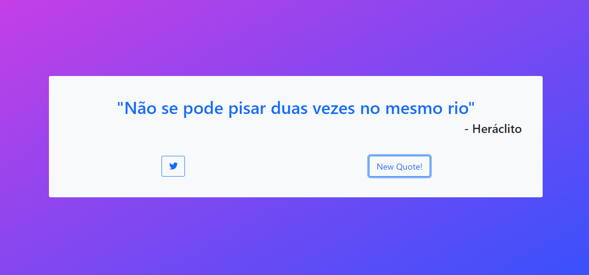

# Random quote machine
Primeiro desafio para obter a certificação em tecnologias front-end na plataforma free-code-camp.
É uma aplicação onde o usuario pode obter citações aleatórias dentre as que estão na base de dados (Dicionario estático), ao apertar o botão "New quote" uma nova citação é escolhida e exibida para o usuário
## Historias de usuário exigidas
- 1: eu consigo ver um elemento wrapper com o id="quote-box" correspondente.

- 2: dentro de #quote-box, eu consigo ver um elemento com o id="text" correspondente.

- 3: dentro de #quote-box, eu consigo ver um elemento com o id="author" correspondente.

- 4: dentro de #quote-box, eu consigo ver um elemento clicável com o id="new-quote" correspondente.

- 5: dentro de #quote-box, eu consigo ver um elemento clicável a com o id="tweet-quote" correspondente.

- 6: ao carregar pela primeira vez, minha máquina de citação exibe uma citação aleatória no elemento com id="text".

- 7: ao carregar pela primeira vez, minha máquina de citação exibe o autor da citação aleatória no elemento com id="author".

- 8: quando o botão #new-quote é clicado, minha máquina de citação deve buscar uma nova citação e exibi-la no elemento #text.

- 9: minha máquina de citação deve buscar o novo autor da citação quando o botão #new-quote for clicado e o exibir no elemento #author.

- 10: eu posso tweetar a citação atual ao clicar no elemento #tweet-quote a. Esse elemento a deve incluir o caminho "twitter.com/intent/tweet" no seu atributo href para tweetar a citação atual.

- 11: o elemento wrapper #quote-box deve ser centralizado horizontalmente. Execute testes com o zoom do navegador em 100% e com a página maximizada.

## Como executar
- Baixe o repositorio
- Abra a basta do projeto no console
```
cd random-quote-machine
```
- Execute o comando
```
npm install
```
- Execute o comando
```
npm run dev
```

## Tecnologias usadas
- Vite
- React
- Bootstrap


## Imagens do projeto

